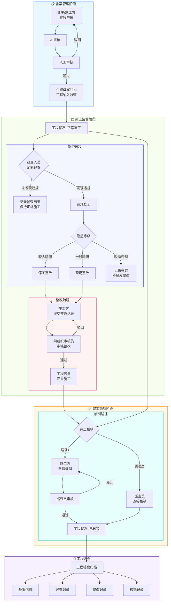
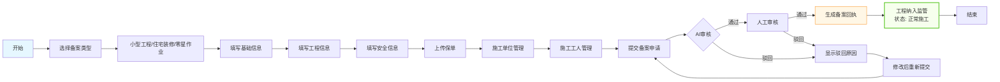
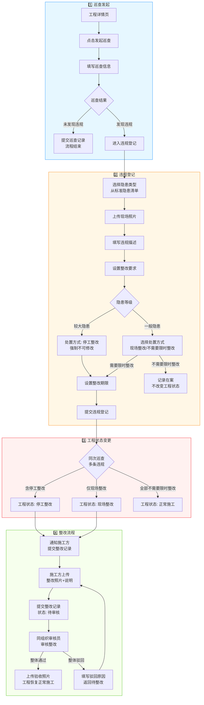
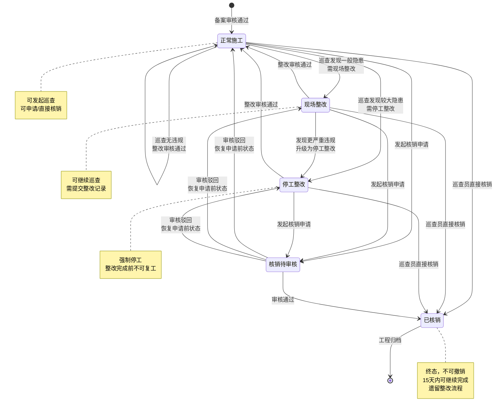
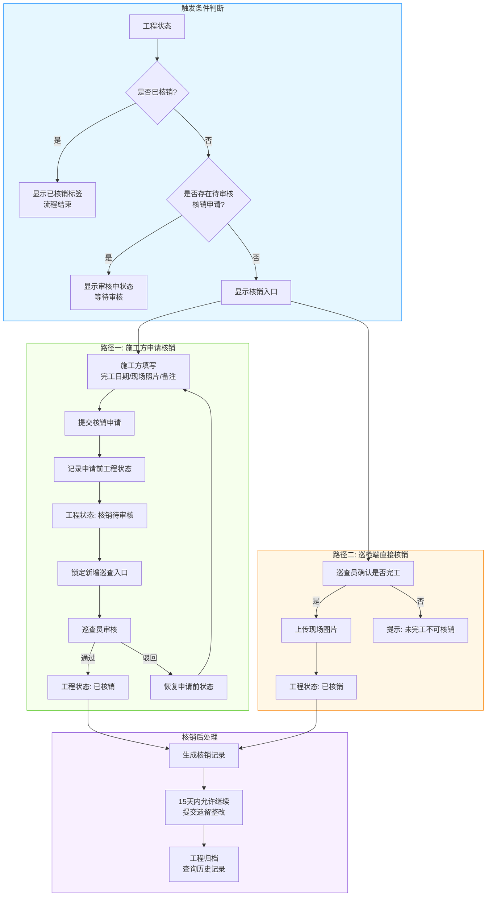
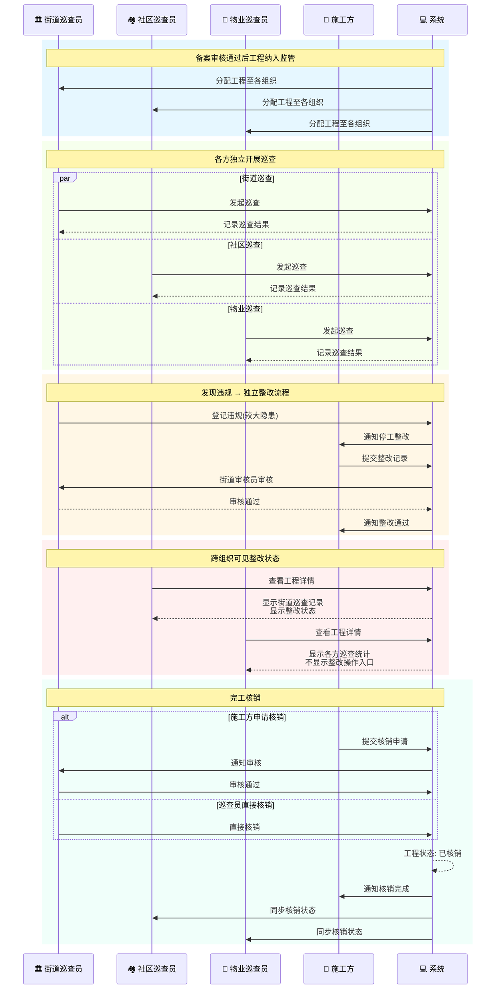
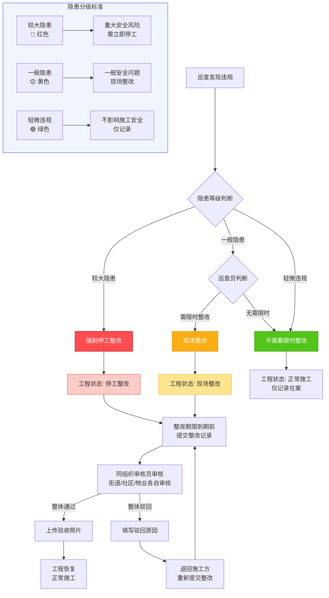
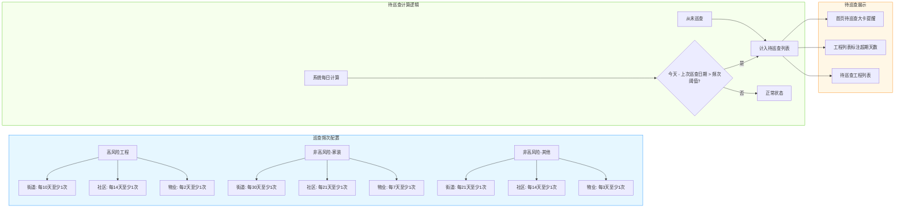
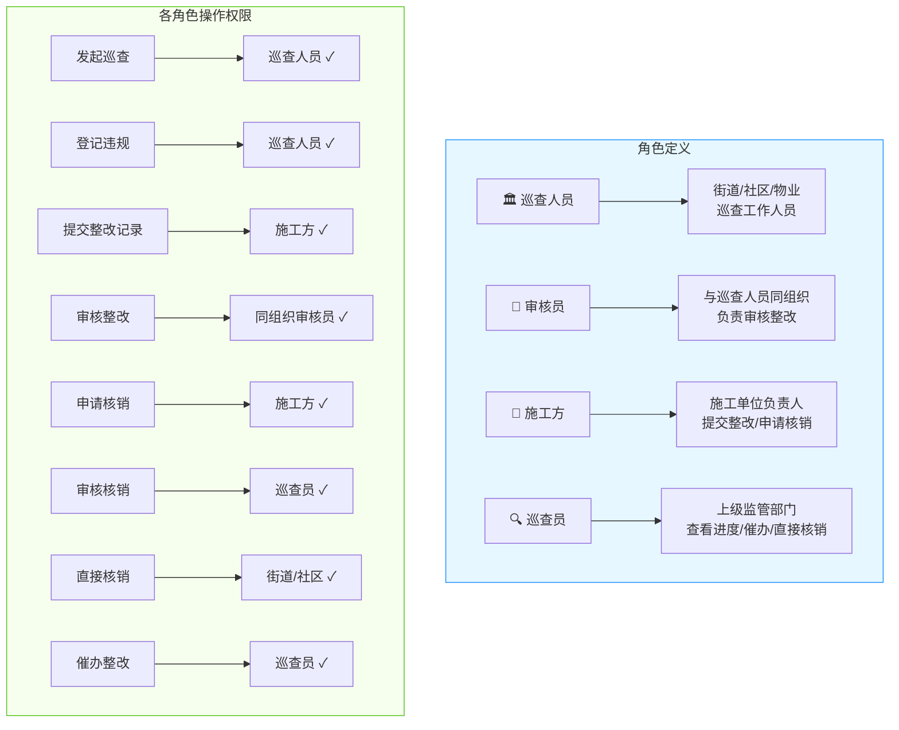

# 小型工程管理系统 - 备案巡查核销流程架构图

> 本文档包含系统从备案到巡查再到完工核销的完整业务流程架构图，使用 Mermaid 语法绘制。

---

## 一、系统整体流程架构图

---

## 二、备案流程详细图

---

## 三、巡查与整改闭环流程图

---

## 四、工程状态流转图

---

## 五、完工核销流程图

---

## 六、三方巡查协同流程图（时序图）

---

## 七、隐患分级处置流程图

---

## 八、巡查频次与待巡查提醒流程

---

## 九、角色权限与操作矩阵

---

## 文档说明

### 使用方式

1. **在线预览**：将本文档内容复制到支持 Mermaid 的编辑器中查看，如：
   - Typora
   - Notion
   - GitHub/GitLab
   - VS Code + Mermaid 插件

2. **导出图片**：使用 Mermaid Live Editor (https://mermaid.live) 在线渲染并导出为图片

### 流程图对应功能模块

| 流程图 | 对应功能模块 | 文档来源 |
|--------|-------------|----------|
| 系统整体流程架构图 | 全系统 | 产品规划汇总 |
| 备案流程详细图 | 备案管理模块 | 备案管理功能设计 |
| 巡查与整改闭环流程图 | 日常巡查模块 | 安全巡检功能设计 |
| 工程状态流转图 | 工程管理 | 安全巡检功能设计 |
| 完工核销流程图 | 完工销项模块 | 完工核销功能设计 |
| 三方巡查协同流程图 | 日常巡查模块 | 安全巡检功能设计 |
| 隐患分级处置流程图 | 日常巡查模块 | 安全巡检功能设计 |
| 巡查频次与待巡查提醒流程 | 日常巡查模块 | 安全巡检功能设计 |
| 角色权限与操作矩阵 | 权限管理 | 产品规划汇总 |

---

*文档生成时间：2026-04-01*
*基于功能设计文档：安全巡检功能设计.md、完工核销功能设计.md、小散业务产品规划.md*
